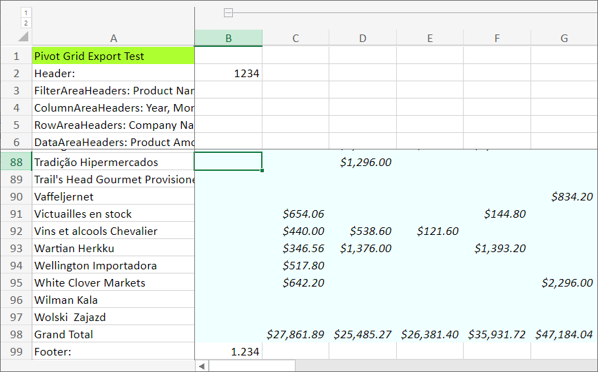

<!-- default badges list -->

<!-- default badges end -->

# Pivot Grid for Web Forms -  How to Customize an Exported Excel Document (Data Aware Export)

The [PivotXlsxExportOptions](https://docs.devexpress.com/AspNet/DevExpress.Web.ASPxPivotGrid.PivotXlsxExportOptions) or [PivotXlsExportOptions](https://docs.devexpress.com/AspNet/DevExpress.Web.ASPxPivotGrid.PivotXlsExportOptions) class provides access to events that allow you to customize the Pivot Grid in the exported document.

The following events are used in this example:

* [CustomizeSheetHeader](https://docs.devexpress.com/CoreLibraries/DevExpress.XtraPrinting.XlsxExportOptionsEx.CustomizeSheetHeader)

    Adds a custom header in the output document in data-aware mode.

* [CustomizeSheetFooter](https://docs.devexpress.com/CoreLibraries/DevExpress.XtraPrinting.XlsxExportOptionsEx.CustomizeSheetFooter)

    Adds a custom footer in the output document in data-aware mode.

* [CustomizeCell](https://docs.devexpress.com/AspNet/DevExpress.Web.ASPxPivotGrid.PivotXlsxExportOptions.CustomizeCell)

    Specifies cell formatting when exporting a Pivot Grid control to XLSX format in data-aware mode.

## files to Review 

* [Default.aspx](./CS/Default.aspx) (VB: [Default.aspx](./VB/Default.aspx))
* [Default.aspx.cs](./CS/Default.aspx.cs) (VB: [Default.aspx.vb](./VB/Default.aspx.vb))

## Documentation

* [Pivot Grid Export](https://docs.devexpress.com/AspNet/114650/components/pivot-grid/export/export)
<!-- feedback -->
## Does this example address your development requirements/objectives?

 

(you will be redirected to DevExpress.com to submit your response)
<!-- feedback end -->
